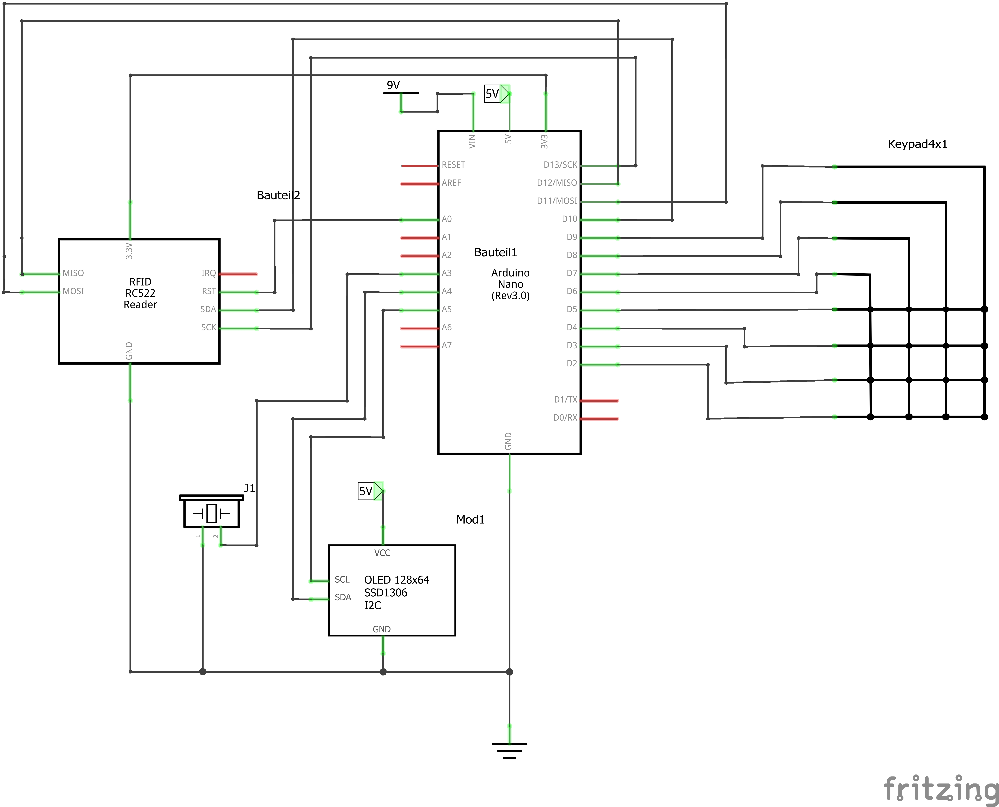

# Hardware
In this project, we will utilize a palette of hardware components. Our main goal is to select good, affordable components that are readily available for easy replication of this project.

## Components

| Component  | Function |
| ------------- | ------------- |
| Arduino Nano  | Controller  |
| 4x4 Matrix Keypad  | Keypad to interact with the system  | 
| RFID Reader RC522  | Enables wireless identification and tracking using radio frequency technology.  | 
| 7-12V Power Adapter  | Supplies DC power within the 7-12V range, suitable for various devices requiring such voltage input. One Voltage level is enough since internal Voltage regulator of Arduino will handle the regulation  | 
| Power Supply Socket  | Provides a connection point for the power adapter to deliver electricity to the device or circuit.  | 
| Buzzer  | Emits audible alerts or signals in electronic circuits or devices  | 

[//]: #

  

## Schematic Version 1

