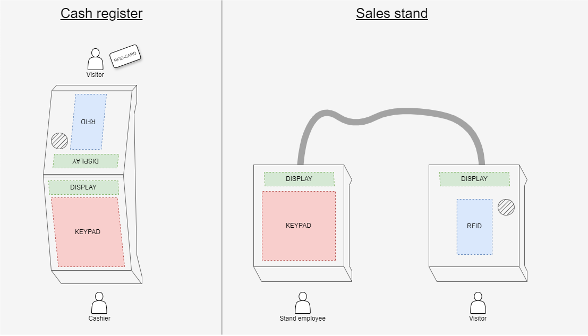

#  RFID-BalanceKeeper

RFID-BalanceKeeper is an project for managing balances on RFID cards. This project provides a simple and effective way to use RFID cards to load funds with money and pay at designated locations.

## Maintainer ✨

Thanks goes to these wonderful people ❤:

<!-- ALL-CONTRIBUTORS-LIST:START - Do not remove or modify this section -->
<!-- prettier-ignore-start -->
<!-- markdownlint-disable -->
<table>
  <tbody>
    <tr>
      <td align="center"><a href="https://github.com/CaTaNa52"> <b>Habib Kilic</b></a>  </td>
      <td align="center"><a href="https://github.com/Yusuf-Tuerkyilmaz"> <b>Yusuf Türkyilmaz</b></a> </td>
      <td align="center"><a href="https://github.com/bayd16"> <b>Bilal Aydemir</b></a> </td>
    </tr>
  </tbody>
</table>
<!-- markdownlint-restore -->
<!-- prettier-ignore-end -->
<!-- ALL-CONTRIBUTORS-LIST:END -->

## Hardware - Building instructions
[Click here](https://github.com/CaTaNa52/RFID-BalanceKeeper/blob/main/Documentation/building%20instructions.md)

## Software - Tutorial
[Click here](https://github.com/CaTaNa52/RFID-BalanceKeeper/blob/main/Documentation/README.md#tutorial)

## Main Features:
* Load Credit onto an RFID card (✔️)
* Withdraw Credit from RFID card (in Progress)
* Easy Management (✔️)
* Security (in Progress)

## Graphical Overview:

## Design

[Click for Version History](https://github.com/CaTaNa52/RFID-BalanceKeeper/tree/main/Documentation/images/Hardware_design_history)

Version 2.0 \

